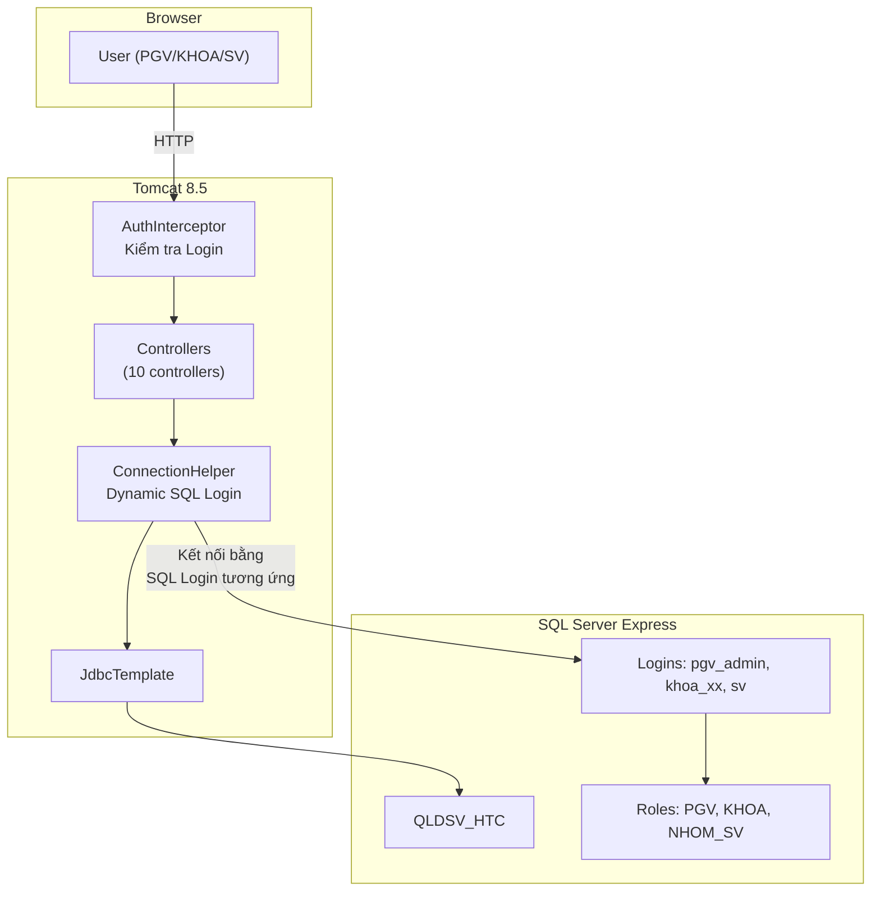

# QLDSV_HTC - Walkthrough & Hướng dẫn Phân quyền SQL Server

## Tổng quan công việc đã hoàn thành

Đã xây dựng hoàn chỉnh hệ thống **Quản lý Điểm Sinh viên Hệ Tín Chỉ** (QLDSV_HTC) bằng Java Spring MVC, gồm:

#### 4. Phân Quyền PGV & Lược bỏ bộ lọc "Khoa" cứng:
- **Header:** Đã xoá toàn bộ Menu Widget Cho phép PGV chủ động Chọn Khoa. 
- **Dashboard:** Nếu `PGV` truy cập, dòng thông tin Khoa xuất hiện trong bảng "Thông Tin Đăng Nhập" tự động được ẩn đi, chỉ KHOA và Sinh viên mới xem mục Khoa.
- **Backend Controllers:** Các Servlet như `SinhVien`, `Lop`, `LopTinChi`, `Diem`, `BaoCao` đều được tái cấu trúc. Khi biến `nhomQuyen` là `PGV`, hệ thống thay vì kèm theo câu lệnh `WHERE MAKHOA=?` sẽ chuyển thành Query Toàn bộ cơ sở dữ liệu `ORDER BY...`. Phía PGV không còn gặp rào cản chia cắt của Chi nhánh Khoa.
- **Form Add:** Để đảm bảo khi PGV cập nhật/thêm một Lớp, Sinh Viên hoặc Môn Học mới mà không bị thiếu thông tin Khoa bắt buộc, Dropdown Menu `Chọn Khoa` đã được lồng ghép sẳn vào lưới nhập liệu (Bị Unhide khi login là thẻ quyền `PGV`).

---

| Hạng mục | Số lượng | Chi tiết |
|----------|----------|----------|
| Java Controllers | 10 files | Login, Home, Lop, SinhVien, MonHoc, LopTinChi, DangKy, Diem, BaoCao, TaiKhoan |
| Java Utilities | 2 files | ConnectionHelper (dynamic SQL connection), AuthInterceptor |
| JSP Views | 13 files | Login, Home, 6 CRUD forms, BaoCao, Report view, Header, Sidebar |
| Static Resources | 2 files | CSS (style.css), JavaScript (app.js) |
| SQL Scripts | 1 file | setup_security.sql (Logins, Roles, Permissions) |
| Config | 2 files | spring-config-mvc.xml, web.xml |

## File ZIP

📦 **Vị trí:** `C:\Users\admin\Desktop\HQTCSDL_De3.zip` (8.03 MB)

---

## 🔐 HƯỚNG DẪN PHÂN QUYỀN TRONG SQL SERVER

### Bước 1: Mở SQL Server Management Studio (SSMS)

Kết nối vào `localhost\SQLEXPRESS` với tài khoản `sa`.

### Bước 2: Chạy Script phân quyền (Đã chạy tự động)

Script đã được chạy tự động. Nếu cần chạy lại:
```sql
-- Mở file: sql\setup_security.sql
-- Hoặc chạy bằng SSMS: File → Open → chọn file → Execute
```

### Bước 3: Kiểm tra Logins đã tạo

Trong SSMS, mở **Security → Logins**, bạn sẽ thấy 4 logins:

| Login | Password | Ý nghĩa |
|-------|----------|---------|
| `pgv_admin` | `123456` | Phòng Giáo vụ - toàn quyền |
| `khoa_cntt` | `khoa123` | Khoa CNTT - quyền hạn chế |
| `khoa_vt` | `khoa456` | Khoa Viễn Thông - quyền hạn chế |
| `sv` | `sv123` | Sinh viên (dùng chung) - quyền tối thiểu |

### Bước 4: Kiểm tra Database Roles

Trong SSMS: `QLDSV_HTC → Security → Roles → Database Roles`:

| Role | Members | Quyền |
|------|---------|-------|
| **PGV** | pgv_admin | SELECT, INSERT, UPDATE, DELETE trên tất cả bảng |
| **KHOA** | khoa_cntt, khoa_vt | SELECT trên tất cả; UPDATE trên DANGKY (nhập điểm) |
| **NHOM_SV** | sv | SELECT trên các bảng; INSERT, UPDATE trên DANGKY (đăng ký) |

### Bước 5: Kiểm tra Permissions (Xác minh trực quan)

Trong SSMS, click chuột phải vào Role `KHOA` → Properties → Securables:
- ✅ SELECT trên KHOA, LOP, SINHVIEN, MONHOC, GIANGVIEN, LOPTINCHI
- ✅ SELECT, UPDATE trên DANGKY
- ❌ KHÔNG có INSERT/DELETE trên KHOA, LOP, SINHVIEN, MONHOC, GIANGVIEN, LOPTINCHI

> [!TIP]
> Để test quyền thủ công: Trong SSMS, kết nối lại bằng login `khoa_cntt` / `khoa123`, thử chạy:
> ```sql
> USE QLDSV_HTC;
> -- Sẽ thành công (có quyền SELECT):
> SELECT * FROM LOP;
> -- Sẽ thất bại (không có quyền INSERT):
> INSERT INTO LOP VALUES ('TEST', 'Test', '2024-2028', 'CNTT');
> ```

---

## 🖥️ CÁC CHỨC NĂNG ĐÃ TRIỂN KHAI

### 3.1. Đăng nhập
- **Giảng viên**: Nhập Login + Password → kiểm tra bảng `TaiKhoan`
- **Sinh viên**: Nhập Mã SV + Password → kiểm tra bảng `SINHVIEN`
- Sinh viên dùng chung SQL login `sv`, nhưng xác thực bằng MASV riêng

### 3.2. Nhập liệu (PGV)
- **Danh mục Lớp**: Form CRUD (Thêm/Xóa/Ghi/Phục hồi/Thoát), lọc theo khoa
- **Sinh viên**: SubForm 2 cấp (chọn Lớp → xem DS SV)
- **Môn học**: Form CRUD đầy đủ
- **Lớp tín chỉ**: Mở/quản lý lớp TC với dropdown Môn học + GV
- **Đăng ký LTC** (SV): Nhập Niên khóa + HK → hiện DS lớp TC chưa hủy → Đăng ký
- **Nhập điểm** (PGV + KHOA): Chọn NK/HK/MH/Nhóm → hiện bảng SV → nhập điểm → Ghi

### 3.3. Phân quyền
- **PGV**: Toàn quyền, tạo TK cho PGV/KHOA
- **KHOA**: Chỉ nhập điểm khoa mình, xem báo cáo khoa mình
- **SV**: Đăng ký LTC, xem phiếu điểm bản thân
- Phân quyền enforce ở **2 tầng**: Application + SQL Server Roles

### 3.4. Báo cáo (5 loại)
1. Danh sách lớp tín chỉ theo NK/HK
2. DS sinh viên đăng ký LTC
3. Bảng điểm hết môn (CC×0.1 + GK×0.3 + CK×0.6)
4. Phiếu điểm SV (điểm max các lần thi)
5. Bảng điểm tổng kết cuối khóa (Cross-Tab)

### 3.5. Quản trị
- Tạo/sửa/xóa tài khoản với nhóm quyền PGV hoặc KHOA

---

## 🚀 HƯỚNG DẪN CHẠY PROJECT

### Cách 1: Trong Eclipse
1. Import project: `File → Import → Existing Projects into Workspace`
2. Chọn thư mục `HQTCSDL_De3`
3. Cấu hình Server: `Window → Preferences → Server → Runtime → Apache Tomcat 8.5`
4. Click phải project → `Run As → Run on Server`
5. Truy cập: `http://localhost:8080/HQTCSDL_De3/login`

### Tài khoản test

| Loại | Login | Password | Mô tả |
|------|-------|----------|-------|
| PGV | `pgv_admin` | `123456` | Toàn quyền |
| KHOA | `khoa_cntt` | `khoa123` | Khoa CNTT |
| KHOA | `khoa_vt` | `khoa456` | Khoa VT |
| SV | Bất kỳ MASV (vd: `N15DCCN001`) | `123456` | Sinh viên |

---

## 📊 KIẾN TRÚC HỆ THỐNG



> [!IMPORTANT]
> **Dynamic SQL Connection**: Khi user đăng nhập, hệ thống tự động chuyển kết nối SQL Server sang login tương ứng (pgv_admin/khoa_cntt/khoa_vt/sv). SQL Server sẽ tự enforce permissions dựa trên Role. Đây là **phân quyền 2 tầng**: Application layer + Database layer.
